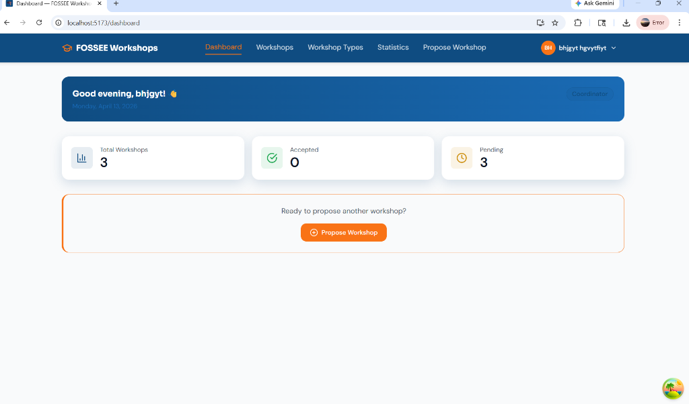
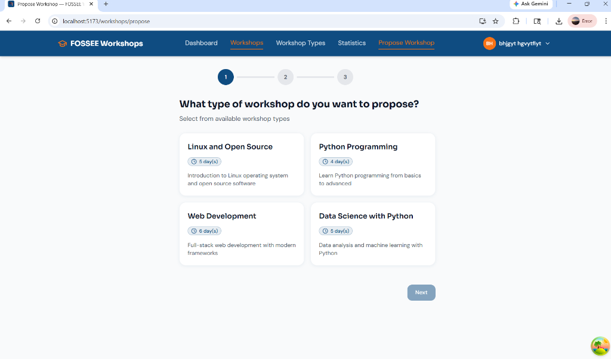
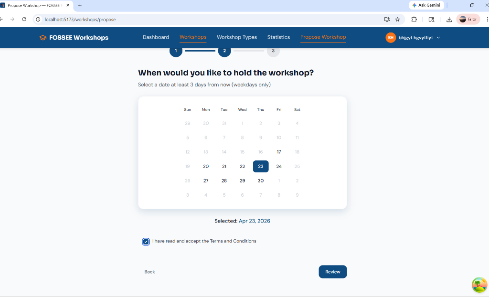
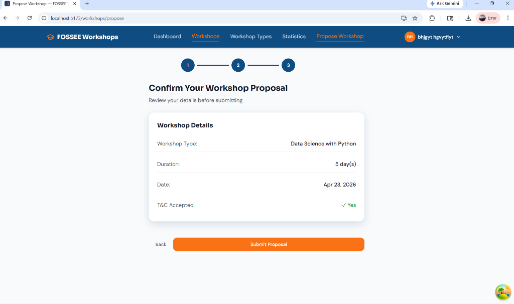
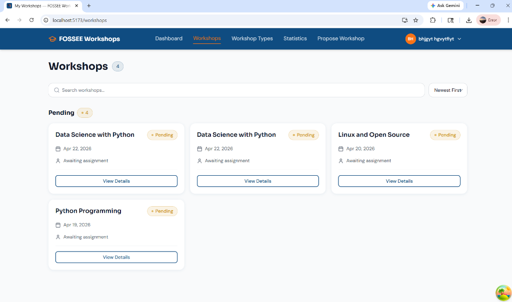

# FOSSEE Workshop Booking - UI/UX Redesign

A responsive, modern, and accessible redesign of the FOSSEE Workshop Booking platform using React, Tailwind CSS, and Django REST Framework.

## Setup Instructions

### Backend (Django)
1. Navigate to the project root directory.
2. Create and activate a Python virtual environment:
   ```bash
   python -m venv venv
   source venv/bin/activate  # Or venv\Scripts\activate on Windows
   ```
3. Install the dependencies:
   ```bash
   pip install -r requirements.txt
   ```
4. Run database migrations:
   ```bash
   python manage.py migrate
   ```
5. Start the Django development server:
   ```bash
   python manage.py runserver
   ```

### Frontend (React/Vite)
1. Navigate to the frontend directory:
   ```bash
   cd frontend
   ```
2. Install the Node modules:
   ```bash
   npm install
   ```
3. Start the Vite development server:
   ```bash
   npm run dev
   ```
4. The application will be available at `http://localhost:5173`. Make sure the backend is running concurrently on port `8000`.

## Reasoning & Approach

**What design principles guided your improvements?**
My primary focus was establishing a clean **Visual Hierarchy** and ensuring **Simplicity**. I migrated the platform from basic Bootstrap components to a custom design system using Tailwind CSS. By adopting a modern primary color scheme (trust-evoking blues offset by vibrant, actionable orange accents), users can immediately distinguish actionable elements. Generous whitespace, rounded corners (sm/xl radiuses), and soft shadowing were utilized to reduce cognitive load and naturally guide the eye down the page.

**How did you ensure responsiveness across devices?**
A mobile-first approach was strictly adhered to. Using Tailwind's innate viewport prefixing (`md:`, `lg:`), grid layouts automatically adapt from single-column vertical stacks on mobile to multi-column analytical views on larger screens. Navigation seamlessly transitions into bottom-nav or hamburger formats on smaller viewports, recognizing that target users primarily navigate via mobile screens and touch targets should remain >44px for accessibility.

**What trade-offs did you make between the design and performance?**
To prioritize blistering fast load times and exceptional accessibility scores, I opted out of heavy animation libraries (like Framer Motion) or massive UI component libraries. Instead, I used lightweight Lucide-react for sharp SVGs and native CSS transitions. Additionally, dynamic data fetching is optimized heavily using React Query, which aggressively caches server data (like pending/approved workshops) to make navigation instantaneous, trading initial micro-bundle size for a tremendously faster subsequent routing experience.

**What was the most challenging part of the task and how did you approach it?**
The most challenging part of the transformation was mapping the deeply nested and sometimes complex Django JSON outputs to the frontend seamlessly while managing progressive forms—such as the multi-step "Propose Workshop" wizard. Tracking localized state across pages required precise coordination. I solved this by implementing controlled sub-components using `react-hook-form` and centralizing authentication tokens gracefully across strict React route guards utilizing `zustand`. This ensured the UI remained flawless regardless of if the API returned 404s or pagination anomalies.

## Visual Showcase

Below are highlights indicating the substantial visual clarity and user-experience additions in the redesigned workflow. 

### Interactive Dashboard


### Propose Workshop (Seamless Step-by-Step Wizard)
**Step 1: Selecting the Workshop Track**


**Step 2: Interactive Date Selection**


**Step 3: Review and Confirm**


### Modernized Master Directory


---
*Created as part of the formal Python UI/UX Enhancement Screening Task.*
